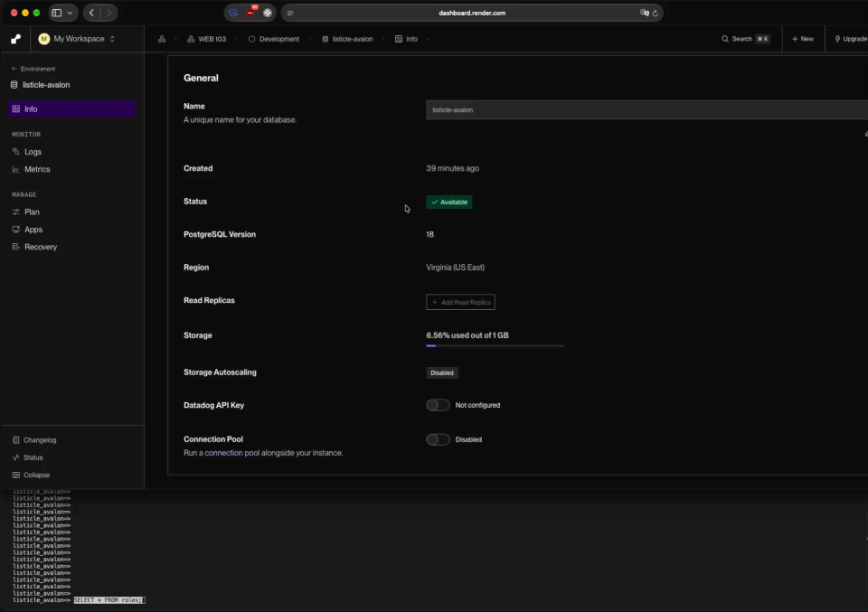

# WEB103 Project 1 - *Avalon Role Guide*

Submitted by: **Muhib Sheikh**

About this web app: **Avalon Role Guide displays each role in the board game The Resistance: Avalon. It includes all 8 unique roles and their info.**

Time spent: **8** hours

## Required Features

The following **required** functionality is completed:

<!-- Make sure to check off completed functionality below -->
- [x] **The web app uses only HTML, CSS, and JavaScript without a frontend framework**
- [x] **The web app displays a title**
- [x] **The web app displays at least five unique list items, each with at least three displayed attributes (such as title, text, and image)**
- [x] **The user can click on each item in the list to see a detailed view of it, including all database fields**
  - [x] **Each detail view should be a unique endpoint, such as as `localhost:3000/bosses/crystalguardian` and `localhost:3000/mantislords`**
  - [x] *Note: When showing this feature in the video walkthrough, please show the unique URL for each detailed view. We will not be able to give points if we cannot see the implementation* 
- [x] **The web app serves an appropriate 404 page when no matching route is defined**
- [x] **The web app is styled using Picocss**

The following **optional** features are implemented:

- [x] The web app displays items in a unique format, such as cards rather than lists or animated list items

The following **additional** features are implemented:

<!--  -[ ] List anything else that you added to improve the site's functionality! -->
- [x] Good and Evil roles use unique card styling
- [x] Individual role pages use readable URL slugs

## Video Walkthrough

Here's a walkthrough of implemented required features:

<!-- Replace this with whatever GIF tool you used! -->
GIF created with macOS screen recorder
<!-- Recommended tools:
[Kap](https://getkap.co/) for macOS
[ScreenToGif](https://www.screentogif.com/) for Windows
[peek](https://github.com/phw/peek) for Linux. -->

## Notes

<!-- Describe any challenges encountered while building the app or any additional context you'd like to add. -->

One challenge I encountered while building the app was connecting the Vite frontend to the Express backend and making sure the correct role data was displayed for each unique URL. 
Also had some issues with get walkthrough and gif, Kap was not working, so I had to use the built in screen recording software and convert to a GIF. I tried using imgur but it would not embed, so I had to stick to the local gif.

## License

Copyright [2026] [Muhib Sheikh]

Licensed under the Apache License, Version 2.0 (the "License"); you may not use this file except in compliance with the License. You may obtain a copy of the License at

> http://www.apache.org/licenses/LICENSE-2.0

Unless required by applicable law or agreed to in writing, software distributed under the License is distributed on an "AS IS" BASIS, WITHOUT WARRANTIES OR CONDITIONS OF ANY KIND, either express or implied. See the License for the specific language governing permissions and limitations under the License.